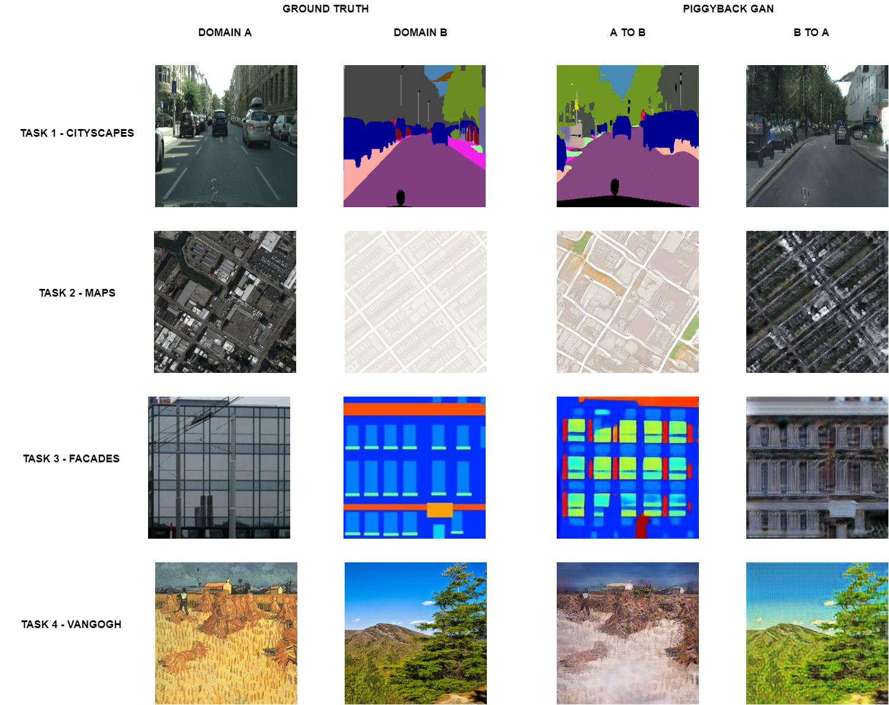

# Piggyback GAN Pytorch

[Piggyback GAN](https://www.sfu.ca/~mnawhal/projects/zhai_eccv20.pdf) is a framework for lifelong learning in generative models. Specifically, it considers the problem of image-to-image translation using the CycleGAN and Pix2Pix framework. The goal (as with any lifelong learning framework) is to be able to learn as many tasks as possible, with minimal increase in no. of parameters. 

The CycleGAN and Pix2Pix code is mostly taken from [here](https://github.com/junyanz/pytorch-CycleGAN-and-pix2pix). 

The main contribution of this repository is the implementation of PiggybackConv and PiggybackTransposeConv module in ```./models/networks.py```. These are custom convolution modules that have unconstrained filters and piggyback filters. As described in the paper, there are only unconstrained filters for Task 1. In the subsequent tasks, there are both piggyback and unconstrained filters. An illustartion of this task-wise filter learning is shown below with a figure from the paper: 

The repository also implements GPU parallelism through nn.DistributedDataParallel. 

## Results
The performance of Piggyback GAN on each of the sequential tasks at the end of 4 tasks is visualized below: 



## Instructions to run
First, run the following to setup the environment: 
```
conda env create -f environment.yml
```

Download 4 cycleGAN datasets:
```
bash ./datasets/download_cyclegan_dataset.sh maps
bash ./datasets/download_cyclegan_dataset.sh facades
bash ./datasets/download_cyclegan_dataset.sh vangogh2photo
```
For cityscapes, read instructions on how to download and prepare, from: ```./datasets/prepare_cityscapes_dataset.py```

To perform training, run: 
```
python pb_cycleGAN.py train=True
```

After training, the following folder structure is created: 
```
+-- checkpoints
    +-- Task_1_cityscapes_cycleGAN
        +-- Intermediate_train_images
        +-- filters.pt 
        +-- latest_checkpoint.pt
    +-- Task_2_maps_cycleGAN
        +-- Intermediate_train_images
        +-- filters.pt 
        +-- latest_checkpoint.pt
    +-- Task_3_facades_cycleGAN
        +-- Intermediate_train_images
        +-- filters.pt 
        +-- latest_checkpoint.pt
    +-- Task_4_vangogh2photo_cycleGAN
        +-- Intermediate_train_images
        +-- filters.pt 
        +-- latest_checkpoint.pt
```
To perform testing from trained model, use:
```
python pb_cycleGAN.py train=False
```

During the testing phase, the code restores the filters from the last task and uses only parts of it for every task. 
This is because with every task, the weights (unconstrined filter bank and piggyback weight matrix) of current and all previous
tasks are stored. 

After testing code is run, a folder called Test_images gets created under each Task_x_y_cycleGAN folder.

## Todo: 
- [x] Add results.
- [x] Include hydra for config management. 
- [x] Add dataset download scripts.
- [ ] Include experiemnts on pix2pix
- [ ] Calculate FID and tabulate results.
